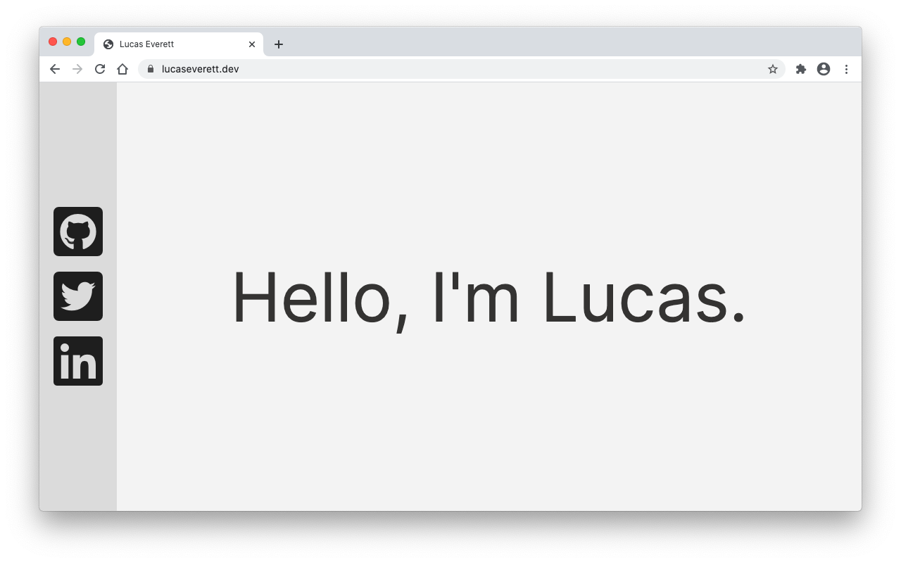

<div style="text-align:center"></div>

# lucaseverett.dev

Built with [Astro](https://astro.build/).

## Live Demo

https://lucaseverett.dev/

## Installation

### Clone the repo

```sh
git clone https://github.com/lucaseverett/lucaseverett.dev.git
```

### Install NPM dependencies

```sh
npm install
```

## Usage

### Start dev server

```sh
npm run dev
```

## Linting

### Lint with ESLint

```sh
npm run lint
```

### Format with Prettier

```sh
npm run format
```

## Building

### Build app

```sh
npm run build
```

### Preview build

```sh
npm run preview
```
